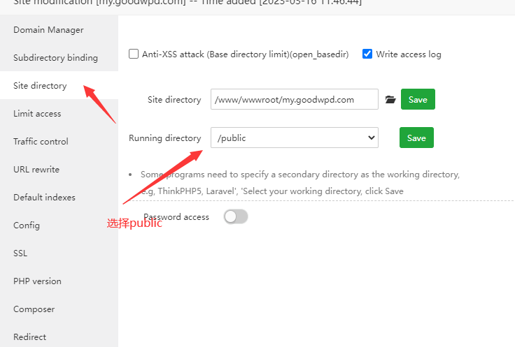

#### V2board + Xrayr 对接教程

    大概的流程如下
    1.域名解析绑定ip
    2.安装宝塔面板（或者国际版）
    3.在宝塔面板内 安装 php 7.4, nginx, mysql5.7 ,并开启相关的设置
    4.在宝塔新增一个网站（可给域名申请https证书），
    5.在网站的根目录安装 V2board
    6.在节点vps安装 XrayR
    7.在v2board 管理后台新增一个节点信息（表单可选择tls）
    8.在XrayR的配置文件，填入新增的节点ID, 并填写其他配置信息,然后重启

#### 以下是具体步骤

###### 一.域名解析绑定 IP

稍等几分钟，ping 这个二级域名，显示是绑定的 ip，说明已经绑定成功

###### 二.安装宝塔面板

      推荐宝塔国际版：https://www.aapanel.com/new/download.html
      查看vps是什么系统，复制对应的安装命令上去即可
      安装完成后，需要记住 访问地址 ，用户名，密码等信息

###### 三.安装 php7.4,nginx, mysql5.7 并开启配置

      这个比较简单忽略

###### 四.新增一个网站，并申请 https 证书

###### 五.安装 V2board

      官网安装教程：https://v2board.com/deploy/aapanel.html

      官网已经非常详细，此处省略安装步骤
